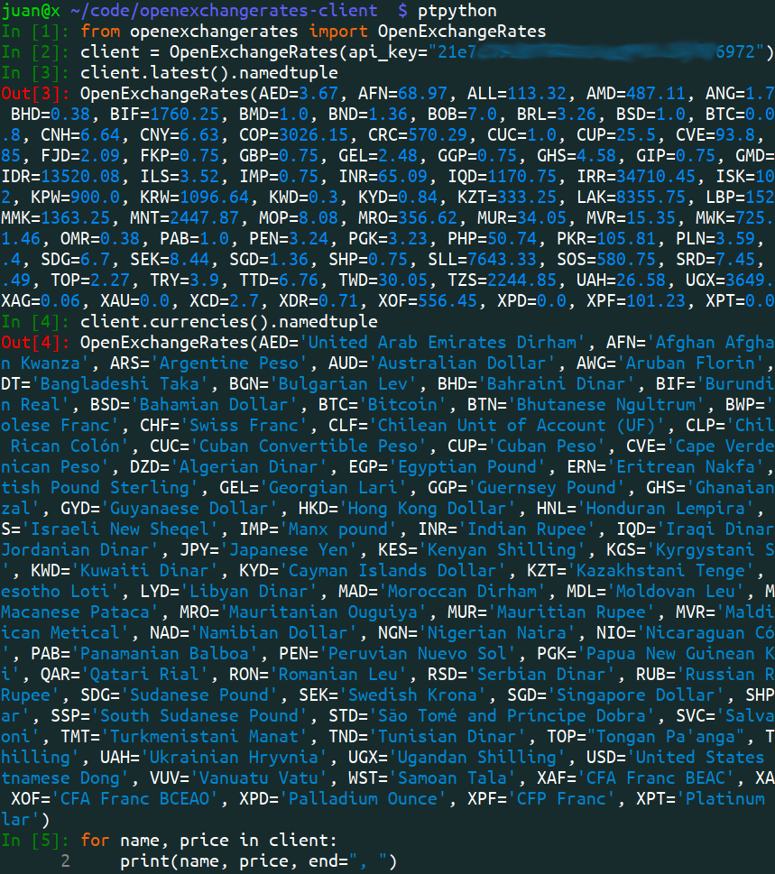
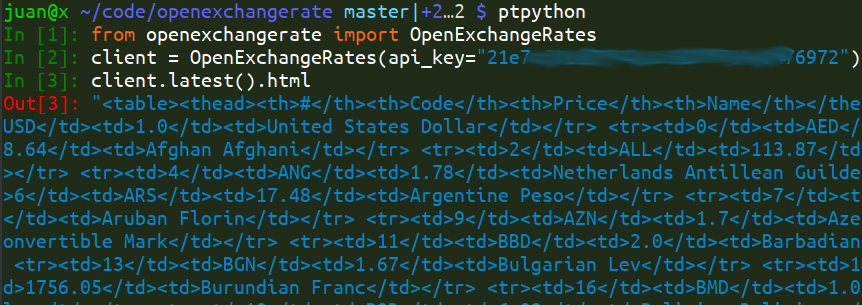

# openexchangerate

OpenExchangeRates API client for Python 3.7+, worldwide exchange prices + Bitcoin price + Gold price.
Can be used as context manager or iterator. Namedtuple, dict and HTML outputs.
No dependencies. Float or Decimal. Optional Timeout. Optional round. 1 file.


- [Example HTML output from `OpenExchangeRates(api_key).latest().html`](https://github.com/juancarlospaco/openexchangerate/blob/master/sample.html)


# Install

```bash
pip install openexchangerate
```


# Use

```python
from openexchangerate import OpenExchangeRates

client = OpenExchangeRates(api_key="21e7c27676972")

client.latest().namedtuple      # .dict for Dictionary, .html for HTML.
client.currencies().namedtuple  # .frozendict for Inmutable Dictionary.

for name, price in client:  # Iterator support.
    print(name, price)

with client as prices:  # Context Manager support.
    print(prices.frozendict)

```






# Tests

```
python -m unittest --verbose --locals tests.TestOpenExchangeRates
```


- [Test Templates.](https://gist.github.com/juancarlospaco/040fbe326631e638f2a540fe8c1f2092)


# Description of OpenExchangeRates

##### OpenExchangeRates
<details>

`openexchangerate.OpenExchangeRates(api_key: str, timeout: int=60, use_float: bool=True, round_float: bool=True, base: str='USD', local_base: str=None)`

**Description:** Returns namedtuple or dict with current international exchange prices and Bitcoin price.

**Arguments:**
- `api_key` Your API Key, [you can get one API Key for Free](https://openexchangerates.org/account/app-ids), string type.
- `timeout` Timeout on Seconds for network connections, integer type, optional.
- `use_float` `True` for `float`, `False` for `decimal.Decimal`, boolean type, optional.
- `round_float` `True` to round floats to 2 decimals, using `round(float, 2)`, boolean type, optional.
- `base` Base currency, **Only for Pay accounts!**, defaults to `"USD"`, string type, optional.
- `local_base` Local Base currency, for Free accounts, to calculate values locally (offline), string type, optional.

**Keyword Arguments:** None.

**Returns:** `collections.namedtuple`.

**Dependencies:** None.

**Source Code file:** https://github.com/juancarlospaco/openexchangerate/blob/master/openexchangerate.py

| State              | OS          | Description |
| ------------------ |:-----------:| -----------:|
| :white_check_mark: | **Linux**   | Works Ok    |
| :white_check_mark: | **Os X**    | Works Ok    |
| :white_check_mark: | **Windows** | Works Ok    |

**Usage Example:**

```python
>>> from openexchangerate import OpenExchangeRates
>>> OpenExchangeRates("21e7c27676972").latest()

```
</details>


# Speed

<details>
<summary>Maximum performance for advanced Linux users.</summary>

```
sudo pip install cython
```

Cython basically translates Python 3 to C and then Compiles C to Binary,
then you can import the generated `*.so` module as a normal Python module.

Its 100% Optional, but recommend. We check that Cython Compiles on Travis.

You dont have to learn anything about Cython, it just works automatically.
The Packages on PyPi dont have any `*.c`, `*.cpp`, `*.pyc`, `*.so`.

[Cython is used by lots of projects and companies.](https://github.com/cython/cython/wiki/projects#projects-using-cython) [Please check Cython documentation for more info.](https://cython.readthedocs.io)

</details>


### Contributors:

- **Please Star this Repo on Github !**, it helps to show up faster on searchs.
- [Help](https://help.github.com/articles/using-pull-requests) and more [Help](https://help.github.com/articles/fork-a-repo) and Interactive Quick [Git Tutorial](https://try.github.io).
- English is the primary default spoken language, unless explicitly stated otherwise *(eg. Dont send Translation Pull Request)*
- Pull Requests for working passing unittests welcomed.


### Licence:

- GNU GPL Latest Version and GNU LGPL Latest Version and any Licence YOU Request via Bug Report.


### Ethics and Humanism Policy:

- Religions is not allowed. Contributing means you agree with the COC.
